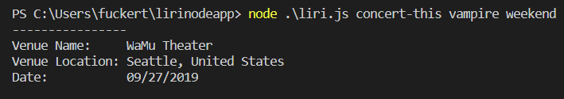

-This app takes in command prompts from node, and calls to various APIs for their response, and outputs it in the console

-I began building this app first by making a switch statement, that depending on which term it took in, would function differently.

-I created functions for each section of the switch statement, each one doing something different

-I took input from the command line using process.argv,and joined them together using the "+" key that way, it can easily be taken into a URL

-depending on which command you use, it sends an axios call and returns all of the info that I wanted displayed to the screen

-lastly, I made an if statement saying that if the input field is empty, output a default object.

-running the app is simple, you type in node .\liri and then you have a choice between 4 options

-you can type movie-this, and then a movie name to display info about it

-typing concert-this and then an artist will return the next tour date for said artist

-spotify-this-song takes in the name of a song, and outputs information about it including artist, and album title

-last but not least, do-what-it-says takes input from a .txt file and runs whatever it says ex. concert-this,"vampire weekend" will run concert-this, and output information for Vampire Weekend.

link to my repository!
https://github.com/Will-25/lirinodeapp

-this app uses API calls from OMDB, Bandsintown, and Spotify. For all of these APIs I used axios calls.

-another crucial technology used in this app is moment.js which formatted the output of the Bandsintown API into the (MMDDYYY) format

